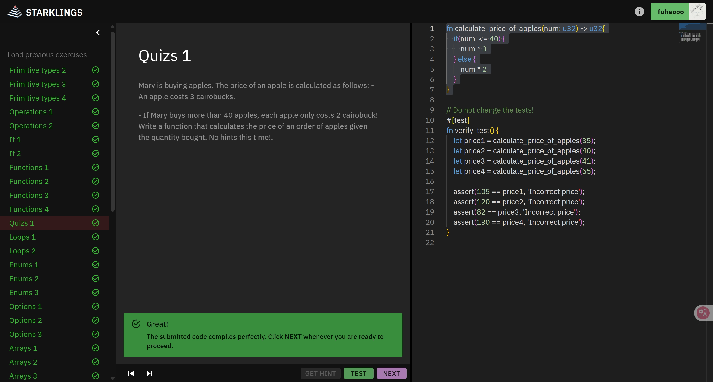

## 第二课：智能合约

完成 Cairo 语言的[线上练习](https://starklings.app/)，然后实现 Quizs 1 的 `calculate_price_of_apples` 函数并提交。



玛丽正在购买苹果。苹果的价格计算方式如下：
- 每个苹果价格为3个 cairobuck。
- 如果玛丽购买超过40个苹果，每个苹果只需2个 cairobuck。

请编写一个函数，根据购买的苹果数量计算订单总价。

```Cairo
// Put your function here!
fn calculate_price_of_apples(num: u32) -> u32{
	if(num <= 40) {
		num * 3
	} else {
		num *2
	}
}

// Do not change the tests!
#[test]
fn verify_test() {
	let price1 = calculate_price_of_apples(35);
	let price2 = calculate_price_of_apples(40);
	let price3 = calculate_price_of_apples(41);
	let price4 = calculate_price_of_apples(65);

	assert(105 == price1, 'Incorrect price');
	assert(120 == price2, 'Incorrect price');
	assert(82 == price3, 'Incorrect price');
	assert(130 == price4, 'Incorrect price');
}
```
